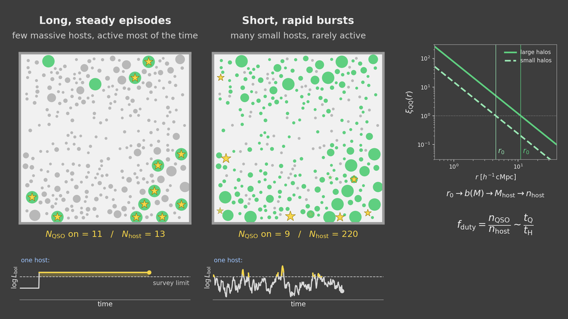
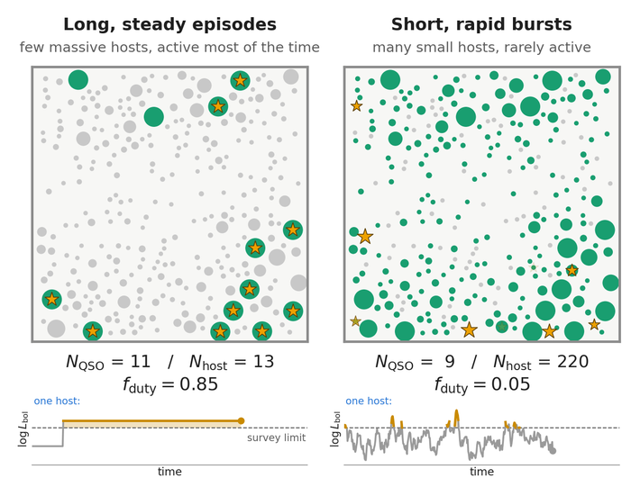
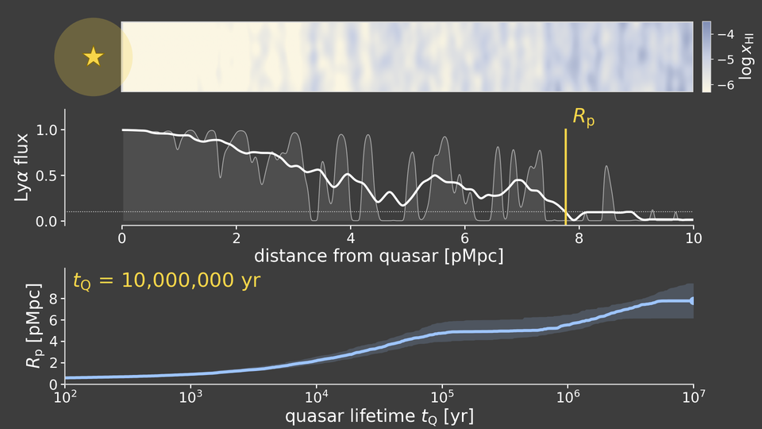
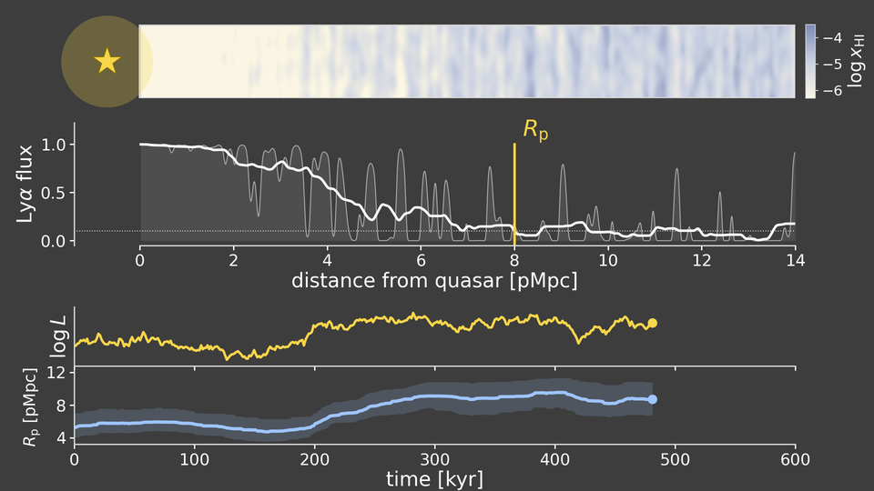

# Quasar lifetime animations

Animations for talks on how two observables constrain quasar lightcurves:

- **Clustering** fixes the host-halo mass, hence the host abundance, hence the
  **duty cycle** $f_{\rm duty} = n_{\rm QSO}/n_{\rm host}$: the fraction of time a host is active.
- **Proximity zones** respond to the quasar's ionizing output on the H I equilibration time
  ($\sim 10^4$ yr), so their size $R_{\rm p}$ probes the **episodic** lifetime $t_{\rm Q}$
  and short-timescale variability.

These are pedagogical toy models, tuned for clarity on a slide, not fits to data.

## Main videos

### Clustering: long steady episodes vs short rapid bursts



Same clustered halo field, same number of visible quasars, one common survey limit in
$L_{\rm bol}$. **Left:** a few massive hosts that are active most of the time
($f_{\rm duty} = 0.85$), each a toy lightbulb that switches on and stays on at constant $L$.
**Right:** many small hosts that are rarely active ($f_{\rm duty} = 0.05$), each a
damped random walk with a short coherence time that only briefly flares above the limit.
Only the clustering strength tells the two apart.

| | Dark slide | White slide |
|---|---|---|
| Boxes + lightcurves + counters | [`clustering_panels_drw_bulb.mp4`](videos/clustering_panels_drw_bulb.mp4) | [`clustering_panels_drw_bulb_light.mp4`](videos/clustering_panels_drw_bulb_light.mp4) |
| Full slide ($\xi(r)$, equations) | [`clustering_dutycycle_drw_full_bulb.mp4`](videos/clustering_dutycycle_drw_full_bulb.mp4) | [`clustering_dutycycle_drw_full_bulb_light.mp4`](videos/clustering_dutycycle_drw_full_bulb_light.mp4) |



### Proximity zones



[`proximity_zone_tq.mp4`](videos/proximity_zone_tq.mp4): the quasar switches on and stays
on. $R_{\rm p}$ grows with $t_{\rm Q}$ until H I reaches equilibrium (~$10^5$ yr), plateaus,
then grows again as the He II photoheating front passes.



[`proximity_zone_drw.mp4`](videos/proximity_zone_drw.mp4): a flickering (DRW) quasar.
$R_{\rm p}$ follows a lagged, smoothed copy of $L(t)$.

## Other clustering variants

| File | What it shows |
|---|---|
| [`clustering_panels_onoff_extreme.mp4`](videos/clustering_panels_onoff_extreme.mp4), [`clustering_dutycycle_onoff_full_extreme.mp4`](videos/clustering_dutycycle_onoff_full_extreme.mp4) | $f_{\rm duty} = 0.85$ vs $0.05$ with toy on/off lightcurves in both boxes (cropped / full slide). |
| [`clustering_panels_drw_extreme.mp4`](videos/clustering_panels_drw_extreme.mp4), [`clustering_dutycycle_drw_full_extreme.mp4`](videos/clustering_dutycycle_drw_full_extreme.mp4) | As above with DRW lightcurves; each box has its own threshold, set so the time above it equals $f_{\rm duty}$. |
| [`clustering_panels_drw_edd.mp4`](videos/clustering_panels_drw_edd.mp4), [`clustering_dutycycle_drw_full_edd.mp4`](videos/clustering_dutycycle_drw_full_edd.mp4) | Common survey limit, DRWs in both boxes differing only in coherence time (long, sustained near-Eddington episodes vs short bursts), plus a slow rise of the mean $\log L$ mimicking exponential BH growth ($L \propto M_{\rm BH} \propto e^{t/t_{\rm Sal}}$). With a fixed limit, more quasars are visible at the end, so the duty cycles shown are clip averages $\langle f_{\rm duty}\rangle$. |

## Running

Requires Python 3 with `numpy`, `scipy`, `matplotlib`, and `ffmpeg` on your PATH.

```bash
pip install -r requirements.txt
./make_all.sh                      # renders every video into videos/ (~1 min each)
```

Individual scripts:

```bash
python clustering_anim.py drw --bulb --info --crop          # cropped boxes + lightcurves
python clustering_anim.py drw --bulb --full --light         # full slide, white background
python clustering_anim.py --help                            # all scenarios and options
python proximity_tq.py
python proximity_drw.py
python proximity_tq.py 10          # any script + a time in seconds -> still PNG of that frame
```

`clustering_anim.py` options:

| Option | Effect |
|---|---|
| `onoff` / `drw` | lightcurve model (default `drw`) |
| `--extreme` | $f_{\rm duty} = 0.85$ (13 hosts) vs $0.05$ (220 hosts); default is $0.75$ vs $0.15$ |
| `--edd` | `--extreme` + common survey limit, long vs short $\tau_{\rm DRW}$, growth trend |
| `--bulb` | `--edd` without growth, and lightbulb hosts on the left (the main video) |
| `--info` / `--full` | counters and $f_{\rm duty}$ / full slide with $\xi(r)$ and equations |
| `--crop` | also write a version cropped to the boxes and lightcurves |
| `--light` | white-background palette |

All physical and visual parameters (duty cycles, host numbers, DRW damping times,
$\Gamma_{\rm UVB}$, heating amplitude, He III front speed, …) are knobs at the top of each file.

## Model notes

**Clustering** (`clustering_anim.py`). Haloes are drawn from a Gaussian random field with
mass-dependent bias, so massive haloes cluster. Hosts are the top-$N$ haloes by mass
(the cap on halo size never falls below the least massive left-box host, so no non-host
is drawn as large as a host there). $N_{\rm host}$ is chosen so that $f_{\rm duty} N_{\rm host}$
is the same in both boxes. With a common survey limit, the DRW of each population is
$\log L = \mu + \sigma x$, with $\mu$ set so that the time above the limit equals $f_{\rm duty}$.
The $\xi(r)$ panel in `--full` mode is a schematic power law.

**Proximity zones** (`proximity_tq.py`, `proximity_drw.py`). Each cell along the sightline
relaxes toward photoionization equilibrium,

$$\frac{dy}{dt} = \Gamma_{\rm UVB}\left[h(T) - \left(1 + \frac{L}{\langle L\rangle}\frac{R_S^2}{r^2}\right) y\right],
\qquad y = x_{\rm HI}/x_{\rm HI,bkg},$$

so the equilibration time grows as $r^2$. He II photoheating: the He III front expands as
$R \propto (\int L\,dt)^{1/3}$ and heats the gas behind it, lowering $x_{\rm HI}$ via
$\alpha_A \propto T^{-0.7}$. The Ly$\alpha$ optical depth is $\tau \propto \Delta^2 y$ on a
lognormal density field. $R_{\rm p}$ is the first radius where the flux, smoothed over
~1 pMpc, drops below 10%. Curves show the median over 150 sightlines with the 16–84% band.
Light-travel-time effects are ignored.

In the DRW clip the He III front is placed beyond the strip (`T_HE_PRIOR`: He III
recombines slowly, so the front remembers all past activity). The gas shown is then uniformly
heated and $R_{\rm p}$ responds to $L(t)$ alone; with the front inside the strip, $R_{\rm p}$
saturates at it whenever $L$ is high. The strip there is 14 pMpc long because the heated
zone reaches ~10 pMpc in the bright state.

## License

MIT, see [LICENSE](LICENSE). If you reuse the animations in a talk, a credit line is appreciated.
